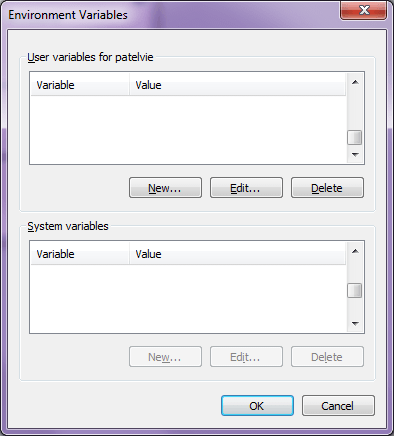

Úvod
####

Proč Maven a srovnání s Ant
***************************

* *"convention over configuration"*
* nezávislost na jazyku, typu projektu ap.
* nezávilost na IDE
* správa závilostí
* standardizuje software lifecycle management
* vnucuje test-driven přístup
* automatizované generování dokumentace, buildů atp. – vhodné pro CI
* modulárně navržený

Historie Maven
==============

* 2002 - vznikl jako subprojekt Jason van Zyla v rámci Apache Turbine
* 2003 - Apache top-level project
* 2004 - Maven 1
* 2005 - Maven 2 - zásadní význam. Maven, tak jak ho známe nyní.
* 2010 - Maven 3 - prakticky zpětně kompatibilní s Maven 2

Srovnání Ant a Maven
====================

Občas srovnáván, ale jedná se o dva poměrně odlišné nástroje.

+---------------------------------+-----------------------------+-------------------------------------+
|                                 |             Ant             |                Maven                |
+=================================+=============================+=====================================+
| vznik                           | pokračovatel např. Make z C | založil novou generaci nástrojů     |
+---------------------------------+-----------------------------+-------------------------------------+
| obvyklé jméno skriptu           | ``build.xml``               | ``pom.xml``                         |
+---------------------------------+-----------------------------+-------------------------------------+
| syntaxe skriptu                 | XML                         | XML                                 |
+---------------------------------+-----------------------------+-------------------------------------+
| obsah skriptu                   | *jak* něco dělat            | *co* dělat bez jak                  |
+---------------------------------+-----------------------------+-------------------------------------+
| podpora v IDE                   | perfektní                   | velmi dobrá                         |
+---------------------------------+-----------------------------+-------------------------------------+
| nový vývojář projektu musí znát | konkrétní ``build.xml``     | Maven, nikoli konkrétní ``pom.xml`` |
+---------------------------------+-----------------------------+-------------------------------------+

Instalace Maven
***************

Instalace Mavenu v Linuxu, Mac OS X i Windows je velmi podobná a spočívá jen v rozbalení archívu a
nastavení několika proměnných prostředí (environment variables).

1. `Stáhněte <http://maven.apache.org/download.cgi>`_ si a rozbalte archív Mavenu. Typické umístění
   bývá

   * v Linuxu ``/usr/local/apache-maven/apache-maven-<verze>``
   * na Windows např. ``C:\Program Files\Apache Software Foundation\apache-maven-<verze>``.

2. Nastavte proměnnou prostředí ``M2_HOME`` na tuto složku.
3. Nastavte proměnnou prostředí ``M2`` na ``M2_HOME/bin/``.
4. Volitelně můžete do proměnné prostředí ``MAVEN_OPTS`` zadat parametry pro JVM volanou Maven
5. Přidejte ``M2`` do ``PATH``.

.. important:: Maven rovněž vyžaduje nastavení systémové proměnné ``JAVA_HOME``. Měla by ukazovat na
   složku JDK (JRE nestačí).

Výpis ``mvn –version`` nám řekne, jestli jsme vše nastavili správně::

  $ mvn --version
  Apache Maven 3.0.4 (r1232337; 2012-01-17 09:44:56+0100)
  Maven home: /usr/share/maven
  Java version: 1.7.0_45, vendor: Oracle Corporation
  Java home: /Library/Java/JavaVirtualMachines/jdk1.7.0_45.jdk/Contents/Home/jre
  Default locale: en_US, platform encoding: UTF-8
  OS name: "mac os x", version: "10.8.5", arch: "x86_64", family: "mac"
  Restarujte terminál/znovu se přihlašte a vyzkoušejte mvn –version.

Linux
=====

V Ubuntu a dalších linuxech tyto kroky znamenají přidat do ``~/.bash_aliases`` (soubor vytvořte,
pokud neexistuje) řádky::

  export M2_HOME=/usr/local/apache-maven/apache-maven-3.0.4/
  export M2=$M2_HOME/bin/
  export PATH=$PATH:$M2
  export JAVA_HOME=/usr/lib/jvm/java-7-openjdk-i386/

Mac
===

Pro uživatele Mac OS X Lion (10.7) a vyšší je dobrou zprávu, že Maven 3 je již součástí jejich
operačního systému ve složce ``/usr/share/maven/``.

Windows
=======

Ve Windows použijte ovládací panel :menuselection:`Environment Variables (Proměnné prostředí)` a nastavte
výše uvedené proměnné prostředí.

   
   Dialog pro nastavení proměnných prostředí ve Windows

Konfigurace Maven
*****************

Konfigurační soubor ``settings.xml`` určuje nastavení specifické pro konkrétní prostředí. Z toho
důvodu by neměl být sdílen mezi vývojáři.

Maven lze konfigurovat z globálního (společný všem uživatelům) nebo uživatelského (jen pro daného
uživatele) souboru ``settings.xml``. Existují-li oba soubory, Maven nastavení sloučí s předností pro
uživatelské nastavení.

+-----------------------------------+--------------------------------+
| globální nastavení (system-wide)  | ``$M2_HOME/conf/settings.xml`` |
+-----------------------------------+--------------------------------+
| uživatelské nastavení (user-wide) | ``~/.m2/settings.xml``         |
+-----------------------------------+--------------------------------+

Elementy v settings.xml odpovídají jednotlivým možnostem nastavení, které popíšeme za okamžik.

.. code-block:: xml
   :caption: Ukázka ``settings.xml`` (zkráceno)
   
   <settings xmlns="http://maven.apache.org/SETTINGS/1.0.0"
     xmlns:xsi="http://www.w3.org/2001/XMLSchema-instance"
     xsi:schemaLocation="http://maven.apache.org/SETTINGS/1.0.0
                         http://maven.apache.org/xsd/settings-1.0.0.xsd">
     <localRepository>...</localRepository>
     <interactiveMode>...</interactiveMode>
     <usePluginRegistry>...</usePluginRegistry>
     <offline>...</offline>
     <pluginGroups>...</pluginGroups>
     <servers>...</servers>
     <mirrors>...</mirrors>
     <proxies>...</proxies>
     <profiles>...</profiles>
     <activeProfiles>...</activeProfiles>
   </settings>

Podívejme se stručně ty nejdůležitější:

* ``<localRepository>`` – umístění lokálního repozitáře (standardně v ``~/.m2/`` (pro Maven 2 i 3))
* ``<offline>`` – build bude pracovat vždy v offline režimu
* ``<pluginGroups>`` – doplnění groupId pro pluginy, které ho neuvádějí (automaticky obsahuje
  org.apache.maven.plugins a org.codehaus.mojo).
* ``<servers>`` – nastavení cesty URL, hesel serverů ap. ve kterých pro stahování a deployment
  určený elementy ``<repositories>`` a ``<distributionManagement>`` POM souboru.
* ``<activeProfiles>`` – jména aktivních profilů (používá-li ``pom.xml`` profily)

Detailní popis najdete v `manuálu Maven <http://maven.apache.org/settings.html>`_.

.. tip:: Ještě lepší popis významu jednotlivých elementů najdete přímo v souboru
   ``M2_HOME/conf/settings.xml``. Tento soubor taky můžete použít jako šablonu pro váše uživatelské
   nastavení a odmazat z něj elementy, které nepotřebujete.